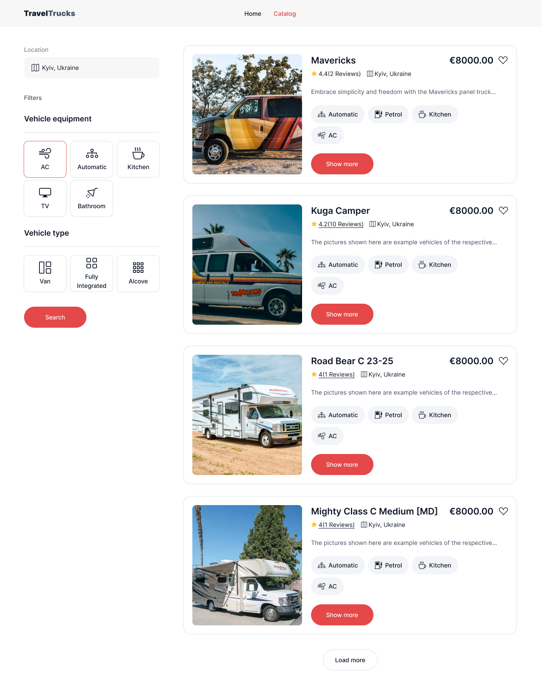
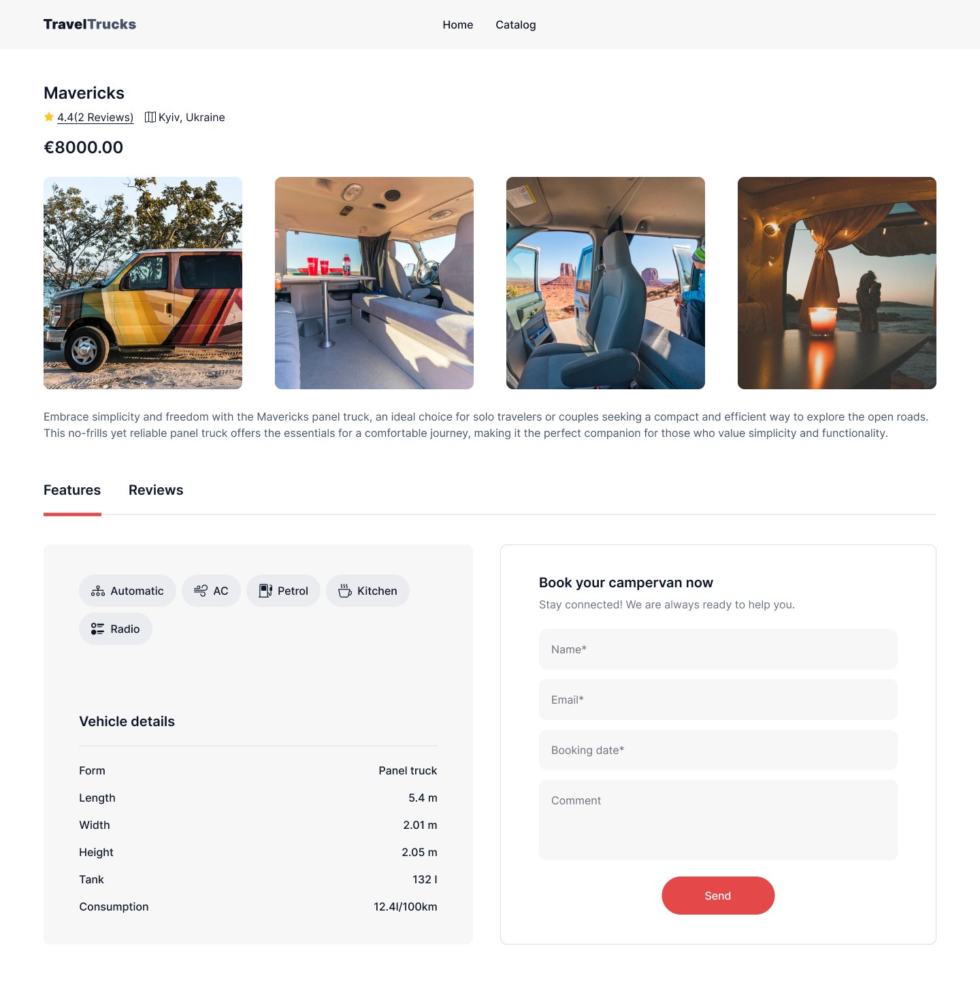
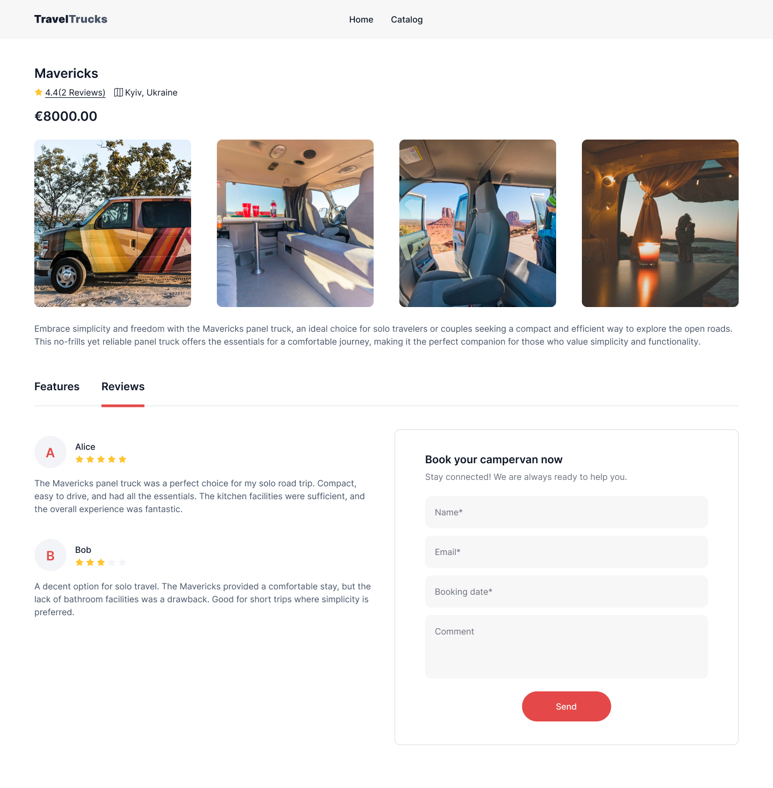

# TravelTrucks 🚐

[Live Demo 🔗](https://goit-neo-test-task-pi.vercel.app/)

---

## Table of Contents 📑

- [About the Project 📚](#about-the-project)
- [Screenshots 📷](#screenshots)
- [Technologies Used ☕️ 🐍 ⚛️](#technologies-used)
- [Setup / Installation 💻](#setup--installation)
- [Approach 🚶](#approach)
- [Status 📶](#status)
- [Credits 📝](#credits)
- [License ©️](#license)

---

## About the Project 📚

**TravelTrucks** is a web application designed to help users discover, book, and review recreational vehicles (RVs) for travel and adventure. The project aims to streamline the process of browsing RVs with filter options, favoriting them, and booking directly through a smooth, user-friendly interface. 

### Features:
- Catalog of RVs with detailed information on each
- Filtering and search functionality based on user preferences
- Detailed views for individual RVs with reviews, ratings, and amenities
- Favorite button to add RVs to a personal list
- Responsive design for mobile and desktop users

---

## Screenshots 📷


*Image of the catalog page with RV listings.*


*Example of the details page for a selected RV.*


*The booking form for RV rentals.*

---

## Technologies Used ☕️ 🐍 ⚛️

- **React** - for building the user interface
- **Redux Toolkit** - for managing global state and actions
- **React Router** - for navigation between different pages
- **Formik & Yup** - for form handling and validation
- **CSS Modules** - for scoped, modular styling
- **FontAwesome** - for icons

---

## Setup / Installation 💻

To get a local copy of the project up and running, follow these steps:

1. **Clone the repository:**
    ```bash
    git clone https://github.com/akolvakh/goit-neo-test-task TravelTrucks
    ```
   
2. **Navigate to the project directory:**
    ```bash
    cd TravelTrucks
    ```

3. **Install dependencies:**
    ```bash
    npm install
    ```

4. **Start the development server:**
    ```bash
    npm run
    ```

The application should be running on `http://localhost:5173`.

---

## Approach 🚶

The project follows a component-based approach, with each feature encapsulated into reusable components. **Redux Toolkit** is used to handle complex state, particularly for managing the catalog of RVs, filter states, and user favorites. The UI elements were built to be responsive and user-friendly. **CSS Modules** ensure styling is scoped to individual components, avoiding conflicts and enhancing modularity.

---

## Status 📶

The project is currently in progress with plans for the following improvements:
- Adding user authentication for personalized booking and favorites
- Implementing a backend API for managing RV data and user bookings
- Enhancing styling and animations for a more polished user experience
- Implement Mobile First approach and adaptive design

---

## Credits 📝

Special thanks to:
- [React Documentation](https://reactjs.org/docs/getting-started.html) for providing excellent resources.
- [Redux Toolkit Documentation](https://redux-toolkit.js.org/) for state management insights.
- Icons by [FontAwesome](https://fontawesome.com/).

---

## License ©️

This project is licensed under the MIT License. See the [LICENSE](LICENSE) file for more details.

---

Feel free to adapt this template to add any additional sections or information specific to your project!